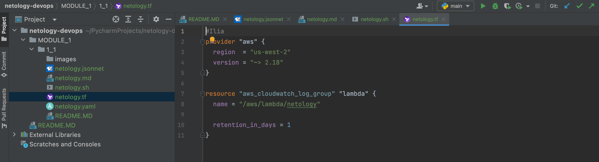

## 1.1. Введение в DevOps - Николюкин Максим

## Скриншоты:
- Terraform

- Bash:

- Markdown

- Yaml

- Jsonnet

---

## Задание №2 - Описание жизненного цикла задачи (разработки нового функционала)

Представьте, что вы работаете в стартапе, который запустил интернет-магазин. 
Ваш интернет-магазин достаточно успешно развивался, и вот пришло время налаживать 
процессы: у вас стало больше конечных клиентов, менеджеров и разработчиков.
Сейчас от клиентов вам приходят задачи, связанные с разработкой нового функционала.
Задач много, и все они требуют выкладки на тестовые среды, 
одобрения тестировщика, проверки менеджером перед показом клиенту. 
В случае необходимости, вам будет необходим откат изменений. 
Вам необходимо описать процесс решения задачи в соответствии с жизненным циклом разработки программного обеспечения. 
Использование какого-либо конкретного метода разработки не обязательно. 
Для решения главное - прописать по пунктам шаги решения задачи (релизации в конечный результат) с участием менеджера, разработчика (или команды разработчиков), 
тестировщика (или команды тестировщиков) и себя как DevOps-инженера.

## Решение задачи
### DevOps - инженер:
1) Внедрить VCS
2) Разработать и внедрить пайплайн CI/CD
3) Интегрировать автотесты в пайплайн
4) Внедрить систему логирования и сбора метрик

### Команда разработки и тестирования:
1) Разработчик пишет код в соответствии с git-flow и осуществляет push изменения в ветку dev
2) Далее инициируется сборка проекта
3) Во время сборки проекта выполняются автотестами
4) После успешного прохождения тестов проект деплоиться, а разработчик делает merge в ветку release
5) Код, попавший в ветку dev далее проходит код-ревью
6) Тимлид или другое ответсвенное лицо одобряет merge
7) Производится максимальное комплексное тестирование тестировщиками, при нахождении ошибок составляется баг-репорт
8) Принимается решение о выпуске продукта в эксплуатацию